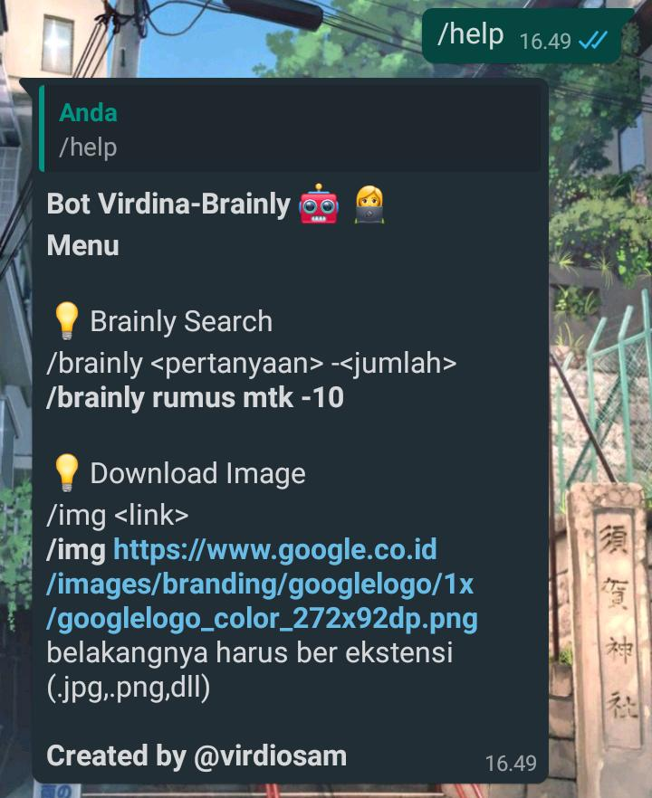

# Whatsapp-Brainly-Bot👩‍💻📚
## Bot whatsapp untuk mendapatkan jawaban dari brainly

## Installation 
`git clone https://github.com/diosamuel/Virdina-Brainly.git`

`npm install`

`npm install whatsapp-web.js`

`node index`

and then qrcode will appear on your terminal, scan it!

# Menu
`/help`

# Feature

1. Brainly
  
  * `/brainly <question> -<amount>`
  * example
  * `/brainly pidato bahasa inggris simpel -10`

2. Image downloader
  
  * `/img <link>`
  * example
  * `/img https://github.githubassets.com/images/modules/logos_page/GitHub-Mark.png`

----
  
**Made with ❤️ by Virdio Samuel**
